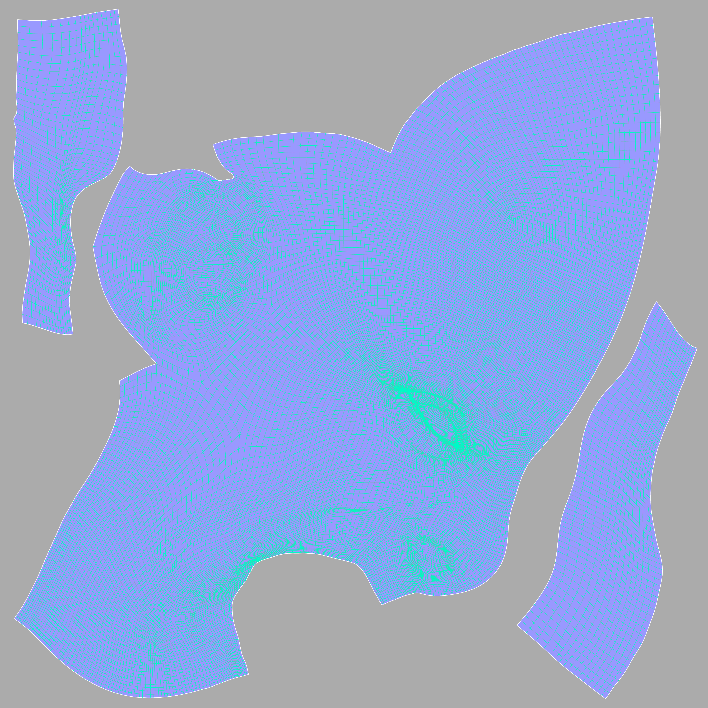

# draw_uvs_from_fbx

A CLI tool that generate images of the UVs of an FBX mesh written in JavaScript. Uses [Minimist](https://github.com/minimistjs/minimist), [Skia](https://github.com/samizdatco/skia-canvas), and [FBX-parser](https://github.com/picode7/fbx-parser)

```bash 
node ./index.mjs --file ./model.fbx --output ./uvs.png
```


